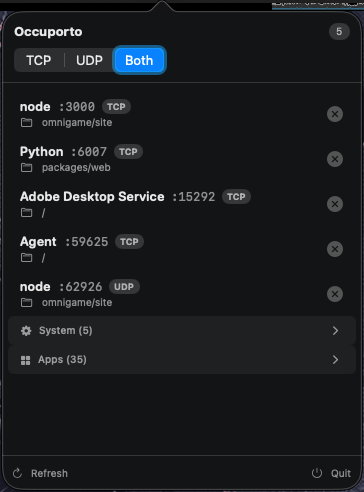

# Occuporto

A small macOS menu bar app for seeing which processes are listening on TCP and UDP ports.



## Features

- Lists listening ports owned by the current user
- Filters by TCP or UDP
- Shows the owning process and working directory
- Groups system processes and installed apps
- Stops a process directly from the menu bar
- Uses native macOS APIs without shelling out to `lsof` or `netstat`

## Install

Download `occuporto.zip` from the [latest release](https://github.com/kirkegaard/occuporto/releases/latest), extract it, and move `occuporto.app` to `/Applications`.

The app is not notarized. On first launch, you may need to right-click the app and choose **Open**.

## Build

Requires Xcode with the macOS 26 SDK.

```sh
xcodebuild -project occuporto.xcodeproj -target occuporto -configuration Release build
```
